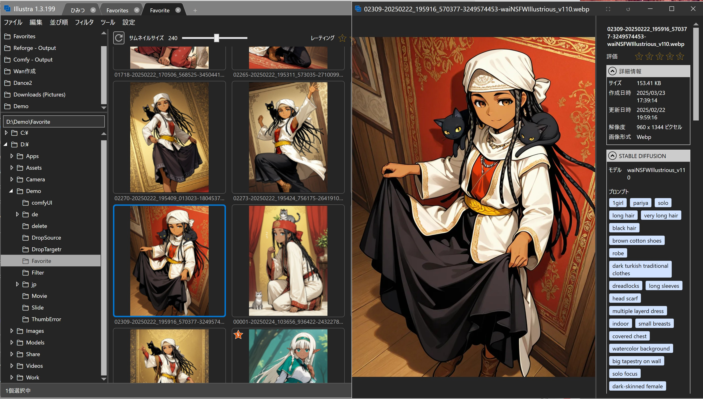

# Illustra - Fast Image Viewer

[日本語](#概要) | [English](#overview)

## 概要

Illustra は、高速で使いやすい Windows 用画像ビューアです。

### スクリーンショット



### 主な機能

- 🚀 高速なサムネイル表示（仮想化スクロール対応）
- 🤖 AI を活用した高速開発
- 📂 フォルダツリーによる簡単なナビゲーション
- 🖼️ カスタマイズ可能なサムネイルサイズ
- ⌨️ キーボードによる快適な操作
- 🔄 スムーズな画像切り替え
- ⭐ 画像レーティングシステム（1-5 星）とフィルタリング機能
- 🔄 日付/ファイル名によるソート機能
- 🎯 設定の永続化対応
- 📝 Stable Diffusion のプロンプト表示対応
- 🏷️ プロンプトのタグによるフィルタリング機能
- 🌓 ライト/ダークテーマの切り替え機能
- 🎬 MP4 動画ファイルの再生
- 🎞️ アニメーション WebP ファイルの再生
- 📑 複数フォルダのタブ表示

### 開発チーム

- nirvash
- ChatGPT 4.0
- Claude 3.7 Sonnet
- Gemini 2.5
- Deepseek V3
- Quasar Alpha

### 動作環境

- Windows 10/11
- .NET 9.0 以降
- 推奨: SSD ストレージ

### インストール

1. [Releases](../../releases) から最新版の `Illustra.zip` をダウンロード
2. お好みの場所に展開
3. `Illustra.exe` を実行

### 使い方

1. 左側のフォルダツリーから画像があるフォルダを選択
2. フォルダツリーで右クリックし、「お気に入りに追加」を選択
3. サムネイルをクリックまたはキーボードで選択
4. Enter キーまたはダブルクリックで画像を表示
5. 画像表示中は左右キーまたはマウスホイールで前後の画像に移動
6. 画像にレーティングを付けるにはプロパティパネルの星マークボタンをクリック
7. 特定のレーティングでフィルターするにはフィルターボタンをクリック
8. ソート順を変更するには画面上部のソートボタンをクリック
9. F11 キーでフルスクリーン切り替え
10. Esc キーで画像ビューを閉じる
11. フォルダツリーでフォルダを右クリックし、「新しいタブで開く」を選択する
12. タブヘッダーをクリックしてタブを切り替える（ドラッグで順序変更も可能）

### タグフィルタの使い方

1. プロパティパネルで Stable Diffusion のプロンプトを確認
2. タグを右クリックしてフィルタするタグを選択
3. フィルタされた画像一覧から目的の画像を素早く見つけることが可能
4. メニューの フィルタ > すべてのフィルタを解除 でフィルタを解除

### 操作説明

#### メイン画面

| 操作     | 動作                                 |
| -------- | ------------------------------------ |
| ←/→/↑/↓  | サムネイル選択の移動                 |
| Home/End | 先頭/末尾のサムネイルへ移動          |
| Enter    | 選択中の画像を表示                   |
| 1-5      | 選択中の画像にレーティングを設定     |
| Ctrl+A   | 全選択                               |
| Ctrl+C   | 選択中の画像をクリップボードにコピー |
| Ctrl+V   | クリップボードから画像を貼り付け     |
| Delete   | ファイルを削除                       |
| F11      | フルスクリーン切り替え               |
| P        | プロパティパネルの表示/非表示        |

#### ビューワ画面

| 操作 | 動作                          |
| ---- | ----------------------------- |
| ←/→  | 前/次の画像に移動             |
| 1-5  | レーティングを設定            |
| P    | プロパティパネルの表示/非表示 |
| F11  | フルスクリーン切り替え        |
| Esc  | ビューワを閉じる              |
| S    | スライドショーの開始/停止     |
| +/-  | スライドショーの間隔を増減    |
| Ctrl+マウスホイール | 画像のズームイン/アウト |
| 左クリック+ドラッグ | 画像をパン（移動） |
| 画面右上の↺ボタン | ズームをリセット |

※ キーボードショートカットはカスタマイズ可能です。設定 → キーボードショートカット設定から変更できます。
以下の機能も設定から任意のキーに割り当てられます：

- レーティングでのフィルタリング（★1-5）
- レーティングフィルタの解除

### ファイル操作

- ドラッグ＆ドロップでのファイル移動
- Ctrl を押しながらのドラッグ＆ドロップでファイルコピー
- Ctrl+A で全てのサムネイルを選択

### コマンドライン起動

```
Illustra.exe [ファイルパス]
```

- ファイルパスを指定して起動すると、そのファイルが存在する場合は対象フォルダを開いてファイルを選択状態にします
- 指定したファイルが存在しない場合は、設定に基づいて起動時のフォルダを開きます

### ソート機能

#### フォルダのソート設定

- フォルダツリー上で右クリックして表示されるコンテキストメニューからソート設定が可能です
- 名前順/作成日順から選択できます
- 昇順/降順を切り替えられます
- ソート設定は各フォルダごとに保存され、次回起動時も維持されます

#### サムネイル一覧のソート設定

- メインウィンドウ上部のソートボタンから設定可能です
- 名前順/作成日順から選択できます
- 昇順/降順を切り替えられます
- 設定は各フォルダごとに保存されます

### MCP 機能

Illustra は Model Context Protocol (MCP) をサポートし、外部クライアントからフォルダの開閉、ファイル選択、メタデータ取得などの操作が可能です。

#### 利用方法

設定メニューで MCP を有効にすると、ローカルで MCP サーバーが起動します。既定では接続に認証トークンが必要で、トークンはアプリの MCP 設定画面で確認できます。「アクセストークン認証を要求する」を無効にした場合は、ヘッダーなしで接続できます。

クライアント側の設定例（VS Code / Cursor 等）:

```json
{
  "servers": {
    "Illustra": {
      "type": "http",
      "url": "http://localhost:5149/mcp",
      "headers": { "Authorization": "Bearer <your-mcp-token>" }
    }
  }
}
```

#### 利用例

- 画像フォルダを開き、サムネイル一覧と選択状態を取得する
- ファイルのメタデータやサムネイル画像を取得する

### TIPS

- ComfyUI の画像のメタデータを確認したい場合は Save Image w/Metadata のカスタムノードで保存することをおすすめします

### 注意事項

レーティング情報はファイルパスに紐づけてデータベースで管理しています。リネームなどでレーティング情報が失われることがあるため、永続的な画像の振り分けなどはフォルダにファイルを移動して分類することをおすすめします。

### 対応言語

- 日本語
- 英語 (English)

言語は設定メニューから切り替え可能です。

### 依存ライブラリ

詳細な依存ライブラリ情報は [English Documentation の Dependencies セクション](#dependencies) を参照してください。

## Contributing

プロジェクトへの貢献をお待ちしています！プルリクエストを気軽に送ってください。

## ライセンス

このプロジェクトは MIT ライセンスの下で提供されています。詳細は [LICENSE](LICENSE) ファイルをご覧ください。

## 免責事項

このソフトウェアは現状のまま提供され、明示または黙示を問わず、いかなる種類の保証もありません。使用に伴うリスクはすべてユーザーが負うものとします。

---

## Overview

Illustra is a fast and user-friendly image viewer for Windows. It implements virtualized thumbnail display and efficient memory management to smoothly browse large numbers of images.

### Screenshot


### Key Features

- 🚀 Fast thumbnail display with virtualized scrolling
- 🤖 AI-powered rapid development
- 📂 Easy navigation with folder tree
- 🖼️ Customizable thumbnail size
- ⌨️ Comfortable keyboard operation
- 🔄 Smooth image switching
- ⭐ Image rating system (1-5 stars) with filtering capabilities
- 🔄 Sorting by date or filename
- 🎯 Persistent settings support
- 📝 Stable Diffusion prompt display support
- 🏷️ Filtering by prompt tags
- 🌓 Light/Dark theme switching
- 🎬 MP4 video file playback
- 🎞️ Animated WebP file playback
- 📑 Multi-folder tab view

### MCP Features

Illustra supports the Model Context Protocol (MCP), allowing external clients to perform operations such as opening folders, selecting files, and retrieving metadata.

#### Usage

Enable MCP from the settings menu to start the local MCP server. Connections require an authentication token by default; the token can be viewed in the MCP settings. If "Require access token authentication" is disabled, clients can connect without the Authorization header.

Client configuration example (VS Code / Cursor, etc.):

```json
{
  "servers": {
    "Illustra": {
      "type": "http",
      "url": "http://localhost:5149/mcp",
      "headers": { "Authorization": "Bearer <your-mcp-token>" }
    }
  }
}
```

#### Examples

- Open an image folder and retrieve the thumbnail list and selection state
- Retrieve file metadata and thumbnail images

### System Requirements

- Windows 10/11
- .NET 9.0 or later
- Recommended: SSD storage

### Installation

1. Download `Illustra.zip` from [Releases](../../releases)
2. Extract to your preferred location
3. Run `Illustra.exe`

### Usage

1. Select an image folder from the folder tree on the left
2. Right-click on a folder in the folder tree and select "Add to Favorites"
3. Click or use keyboard to select thumbnails
4. Press Enter or double-click to view images
5. Use left/right keys or mouse wheel to navigate between images
6. Assign ratings to images by clicking the star buttons in the property panel
7. Filter by specific rating using the filter buttons
8. Change sort order using the sort buttons at the top
9. Press F11 to toggle fullscreen
10. Press Esc to close image view
11. Right-click a folder in the folder tree and select 'Open in New Tab'
12. Click tab headers to switch between tabs (drag to reorder)

### Using Tag Filters

1. Check Stable Diffusion prompts in the property panel
2. Right-click on a tag and select it to apply filter
3. Quickly find images in the filtered thumbnail list
4. Clear filters by selecting Filter > Clear All Filters from the menu

### Operation Guide

#### Main Window

| Operation | Action                            |
| --------- | --------------------------------- |
| ←/→/↑/↓  | Move thumbnail selection          |
| Home/End | Move to first/last thumbnail      |
| Enter    | Display selected image            |
| 1-5      | Set rating for selected image     |
| Ctrl+A   | Select all thumbnails             |
| Ctrl+C   | Copy selected images to clipboard |
| Ctrl+V   | Paste images from clipboard       |
| Delete   | Delete file                       |
| F11      | Toggle fullscreen                 |
| P        | Toggle property panel             |

#### Image Viewer

| Key | Action                    |
| --- | ------------------------- |
| ←/→ | Previous/Next image       |
| 1-5 | Set rating                |
| P   | Toggle property panel     |
| F11 | Toggle fullscreen         |
| Esc | Close viewer              |
| S   | Toggle slideshow          |
| +/- | Adjust slideshow interval |

#### Image Operations

| Operation | Action |
| --------- | ------ |
| Ctrl+Mouse wheel | Zoom in/out |
| Left-click+drag | Pan (move) image |
| ↺ button (top-right) | Reset zoom |

Note: Keyboard shortcuts are customizable. You can modify them in Settings → Keyboard Shortcuts.
The following features can also be assigned to any key:

- Rating filters (★1-5)
- Clear rating filter

### File Operations

- Select all thumbnails with Ctrl+A
- Move files with drag & drop
- Copy files with drag & drop while holding Ctrl

### Command Line Launch

```
Illustra.exe [file_path]
```

- When launched with a file path, if the file exists, it opens the containing folder and selects the file
- If the specified file does not exist, it opens a folder based on startup settings

### Sort Functions

#### Folder Sort Settings

- Access sort settings through the context menu by right-clicking in the folder tree
- Choose between sorting by name or creation date
- Toggle between ascending and descending order
- Sort settings are saved per folder and persist across application restarts

#### Thumbnail List Sort Settings

- Access sort settings from the sort buttons at the top of the main window
- Choose between sorting by name or creation date
- Toggle between ascending and descending order
- Settings are saved for each folder

### Important Note

Rating information is managed in a database linked to file paths. Rating data may be lost when files are renamed. For permanent image classification, it is recommended to organize files by moving them into folders rather than relying solely on ratings.

### Supported Languages

- Japanese
- English

Language can be changed from the settings menu.

## Development

### Development Team

- nirvash
- ChatGPT 4.0
- Claude 3.7 Sonnet
- Gemini 2.5
- Deepseek V3
- Quasar Alpha

### Requirements

- Visual Studio 2022 or later
- .NET 9.0 SDK

### Build

```bash
dotnet build
```

### Run

```bash
dotnet run --project src/Illustra/Illustra.csproj
```

### Dependencies

#### Image Processing & UI

- [SkiaSharp](https://github.com/mono/SkiaSharp) - Fast image processing
  - License: MIT
  - Used for: Image processing and thumbnail generation
- [SixLabors.ImageSharp](https://github.com/SixLabors/ImageSharp) - Modern image processing
  - License: Apache 2.0
  - Used for: Additional image format support and processing
- [Hjg.Pngcs](https://github.com/leonbloy/pngcs) - PNG file handling
  - License: Apache 2.0
  - Used for: Advanced PNG metadata handling
- [gong-wpf-dragdrop](https://github.com/punker76/gong-wpf-dragdrop) - Drag & Drop functionality
  - License: BSD 3-Clause
  - Used for: File drag & drop operations
- [VirtualizingWrapPanel](https://github.com/sbaeumlisberger/VirtualizingWrapPanel) - Virtualized thumbnail display
  - License: MIT
  - Used for: Virtualized thumbnail list display
- [Extended.Wpf.Toolkit](https://github.com/xceedsoftware/wpftoolkit) - Additional WPF controls
  - License: MS-PL
  - Used for: Enhanced UI controls and utilities
- [MahApps.Metro](https://github.com/MahApps/MahApps.Metro) - Modern UI framework
  - License: MIT
  - Used for: Modern UI styling and controls

#### Application Framework

- [Prism](https://github.com/PrismLibrary/Prism) - MVVM framework
  - License: MIT
  - Used for: Implementation of MVVM architecture
- [Microsoft.Extensions.DependencyInjection](https://github.com/dotnet/runtime) - DI container
  - License: MIT
  - Used for: Dependency injection

#### Data Management

- [Newtonsoft.Json](https://www.newtonsoft.com/json) - JSON framework
  - License: MIT
  - Used for: Settings file serialization/deserialization
- [SQLite-net](https://github.com/praeclarum/sqlite-net) - SQLite ORM
  - License: MIT
  - Used for: Rating data persistence

## License

This project is licensed under the MIT License - see the [LICENSE](LICENSE) file for details.

## Author

- nirvash

## Contributing

Contributions are welcome! Please feel free to submit a Pull Request.
