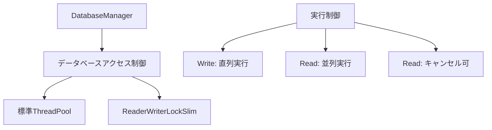
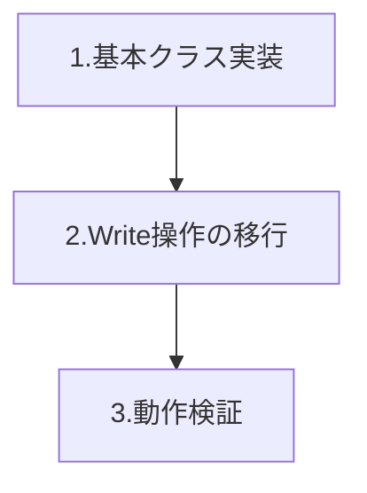
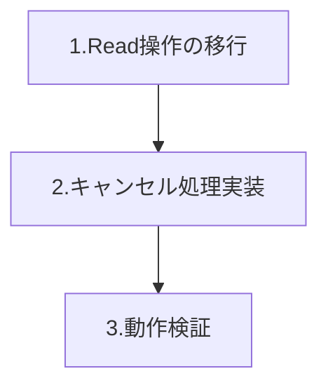
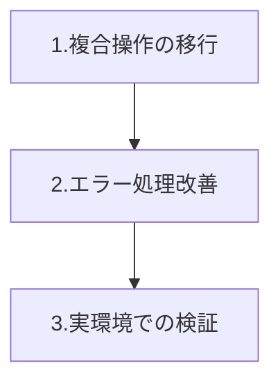

# データベースアクセス制御のリファクタリング計画

## 設計セクション

### 背景と課題
- 複数スレッドからの同時アクセスによるデータベースのロック問題
- `database is locked` エラーの発生
- 非効率なリトライ処理

### アーキテクチャの概要



### 設計方針
1. **シンプルな実装**
   - 標準ThreadPoolの使用
   - 明確な読み書きの分離
   - 最小限の抽象化

2. **安全性の確保**
   - Write操作の直列実行
   - Read操作の並列実行（Write優先）
   - トランザクションの確実な完了

3. **拡張性の考慮**
   - スレッドプール実装の切り替え可能性
   - メトリクス収集ポイントの確保
   - ロギング機能の追加容易性

### 期待される効果
- データベースロックエラーの解消
- 処理の安定性向上
- パフォーマンスの改善

## 実装者向けセクション

### 技術的な詳細

#### データベースアクセス制御
```csharp
// 基本構造
public class DatabaseAccess
{
    private readonly ReaderWriterLockSlim _lock = new ReaderWriterLockSlim();

    // Read操作用
    public async Task<T> ReadAsync<T>(Func<DataConnection, Task<T>> operation,
                                    CancellationToken cancellationToken = default)

    // Write操作用
    public async Task WriteAsync(Func<DataConnection, Task> operation)
}
```

#### 重要な実装ポイント
1. **ロック制御**
   - ReadLockは複数同時取得可能
   - WriteLockは排他的
   - Write優先の制御

2. **トランザクション管理**
   - Write操作は必ずトランザクション内で実行
   - エラー時は確実にロールバック
   - Read操作はトランザクション不要

3. **エラーハンドリング**
   - データベースロックエラーの検出
   - リトライ処理の実装
   - 適切な例外伝播

### 設定項目
```csharp
public class DatabaseConfig
{
    public int MaxRetryCount { get; set; } = 5;
    public int RetryDelayMilliseconds { get; set; } = 200;
    public TimeSpan CommandTimeout { get; set; } = TimeSpan.FromSeconds(30);
}
```

## 移行計画

### フェーズ1: 基本実装


1. **基本クラスの実装** (1-2日)
   - DatabaseAccess クラスの作成
   - ReaderWriterLockSlim の実装
   - 基本的なインターフェースの定義

2. **Write操作の移行** (2-3日)
   - SaveFileNodeAsync
   - UpdateRatingAsync
   - SaveFileNodesBatchAsync
   - DeleteFileNodeAsync

3. **動作検証** (1日)
   - 実機での基本動作確認
   - エラーケースの確認
   - パフォーマンス計測

### フェーズ2: Read操作の移行


1. **Read操作の移行** (2-3日)
   - GetFileNodesAsync
   - GetFileNodeAsync
   - GetSortedFileNodesAsync

2. **キャンセル処理の実装** (1-2日)
   - CancellationToken対応
   - タイムアウト処理
   - エラーハンドリング

3. **動作検証** (1日)
   - 実環境での動作確認
   - エラー発生時の挙動確認
   - 実際の使用シナリオでのテスト

### フェーズ3: 複雑な操作の移行


1. **複合操作の移行** (2-3日)
   - GetOrCreateFileNodesAsync
   - HandleFileRenamedAsync
   - トランザクション制御の実装

2. **エラー処理の改善** (1-2日)
   - エラーログの強化
   - リトライロジックの調整
   - エラー通知の実装

3. **実環境での検証** (2-3日)
   - 実際の使用パターンでの検証
   - エッジケースの確認
   - パフォーマンス最終確認

### 検証のポイント

1. **動作確認項目**
   - データベースロックエラーの発生有無
   - 処理の完了確認
   - UIの応答性

2. **エラー処理の確認**
   - 想定されるエラーの発生と回復
   - リトライ動作の確認
   - エラーログの出力

3. **パフォーマンス確認**
   - 処理時間の測定
   - メモリ使用量の確認
   - CPU使用率の確認

### リスク管理

1. **想定されるリスク**
   - データベースロックの発生
   - パフォーマンスの低下
   - 予期せぬエラーの発生

2. **対応策**
   - 詳細なログ収集
   - 即時ロールバック手順の準備
   - 段階的な展開

### スケジュール
- 全体期間: 2週間
- 各フェーズ: 3-5営業日
- バッファ: 2-3営業日

### 成功基準
1. データベースロックエラーの発生がゼロ
2. 既存機能が正常に動作
3. パフォーマンスが既存以上を維持
