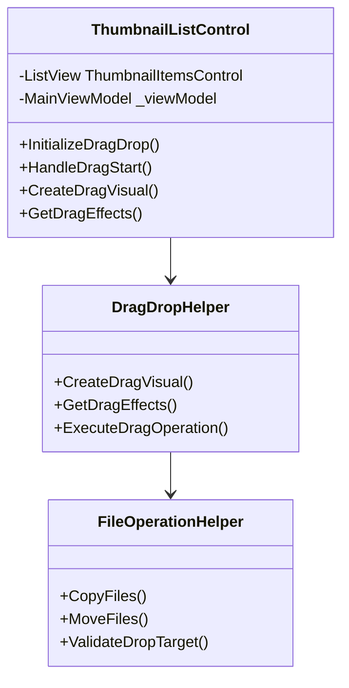

# サムネイル一覧の複数選択＆ドラッグ＆ドロップ機能 実装計画

## 概要
サムネイル一覧から複数ファイル選択して、ドラッグ＆ドロップでエクスプローラにドロップしてコピーや移動を可能にする機能の実装計画です。

## 1. アーキテクチャ設計

### コンポーネント構成



### コンポーネントの役割

1. **ThumbnailListControl**（既存の修正）
   - 複数選択の有効化
   - ドラッグ＆ドロップイベントのハンドリング
   - ドラッグ視覚効果の表示

2. **DragDropHelper**（新規）
   - ドラッグ視覚効果の生成
   - ドラッグ操作の管理（コピー/移動の判定）
   - ドロップ効果の制御

3. **FileOperationHelper**（新規）
   - ファイルシステム操作の実行
   - ドロップ先の検証
   - エラーハンドリング

## 2. UI/UX仕様

### ドラッグ操作
- 即座にドラッグ開始
- 複数選択はCtrlキーまたはShiftキーで対応
- ドラッグ中の視覚効果：
  - 単一選択時：サムネイル表示
  - 複数選択時：重なったサムネイル表示

### ドロップ操作
- 標準のWindowsドラッグ効果を表示
  - コピー操作時：＋マーク
  - 移動操作時：矢印
  - 無効な場所：🚫マーク
- ドロップ時の操作選択
  - Ctrlキー押下：コピー
  - Shiftキー押下：移動
  - 通常：デフォルト操作（移動）

## 3. 実装詳細

### 3.1 ThumbnailListControl.xaml の変更
```xaml
<ListView x:Name="ThumbnailItemsControl"
          SelectionMode="Extended"  <!-- 変更: 複数選択を有効化 -->
          AllowDrop="True"         <!-- 追加: D&Dを有効化 -->
          PreviewMouseLeftButtonDown="ThumbnailItemsControl_PreviewMouseLeftButtonDown"
          PreviewMouseMove="ThumbnailItemsControl_PreviewMouseMove"
          ...>
```

### 3.2 DragDropHelper の実装
```csharp
public class DragDropHelper
{
    public UIElement CreateDragVisual(IList<FileNodeModel> selectedItems)
    {
        // ドラッグ視覚効果の生成
        // - 単一選択：サムネイル表示
        // - 複数選択：重なったサムネイル表示
    }

    public DragDropEffects GetDragEffects(DragEventArgs e)
    {
        // ドロップ先に応じたエフェクト判定
        // - エクスプローラ：コピー/移動
        // - 非対応先：None
    }
}
```

### 3.3 FileOperationHelper の実装
```csharp
public class FileOperationHelper
{
    public async Task ExecuteFileOperation(
        IList<string> sourcePaths,
        string targetPath,
        bool isCopy)
    {
        // ファイル操作の実行
        // - コピー/移動の処理
        // - プログレス表示
        // - エラーハンドリング
    }
}
```

## 4. 実装手順

### Phase 1: 基本実装
1. ThumbnailListControlの複数選択対応
2. 基本的なドラッグ＆ドロップイベントの実装
3. ユニットテストの作成

### Phase 2: ドラッグ機能
1. ドラッグ開始の判定処理実装
2. ドラッグ視覚効果の作成
3. 選択アイテムのデータ設定実装

### Phase 3: ドロップ機能
1. ドロップ効果の判定実装
2. ファイル操作の実行処理
3. エラーハンドリングの実装

### Phase 4: UI/UX改善
1. ドラッグ中の視覚効果の改善
2. プログレス表示の実装
3. エラー通知の実装

## 5. 考慮事項

### パフォーマンス
- 大量ファイル選択時の処理最適化
- ドラッグ視覚効果の軽量化
- メモリ使用量の監視

### エラーハンドリング
- アクセス権限エラー
- ディスク容量不足
- 同名ファイルの処理
- ネットワークドライブの切断

### UI/UX
- ドラッグ開始の即時性確保
- 視覚的フィードバックの一貫性
- キーボード操作との整合性確保
- アクセシビリティ対応

## 6. テスト計画

### ユニットテスト
- 複数選択機能のテスト
- ドラッグ＆ドロップ操作のテスト
- ファイル操作のテスト

### UIテスト
- ドラッグ視覚効果のテスト
- キーボード操作のテスト
- エラー表示のテスト

### 統合テスト
- エクスプローラとの連携テスト
- 大量ファイル操作テスト
- エラー状況のテスト
