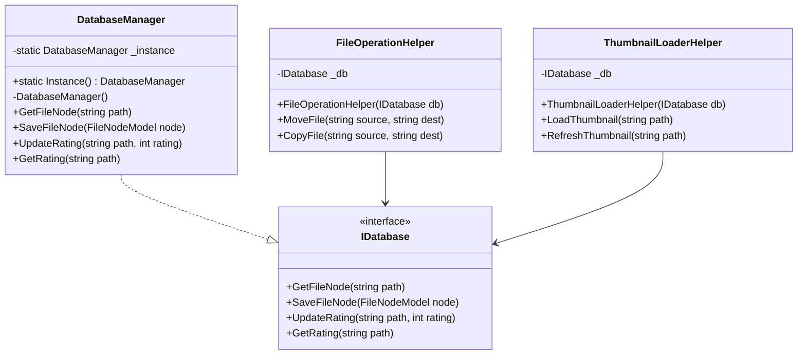

# ファイル操作機能の設計

## 背景と目的

現状の課題として以下が挙げられます：
- ファイル操作が複数のヘルパークラスに分散している
- ファイルの移動/コピー時のレーティング引き継ぎ機能がない
- データベースアクセスの一元管理が必要

これらの課題を解決するため、ファイル操作とデータベースアクセスの再設計を行います。

## アーキテクチャ設計

### クラス構成



### 責務の分離

1. **FileOperationHelper**
   - ファイル操作（移動、コピー、削除、名前変更）の一元管理
   - レーティング情報の自動的な引き継ぎ処理
   - データベース更新処理の統合

2. **ThumbnailLoaderHelper**
   - サムネイル管理に特化
   - 画像の読み込みとキャッシュ管理
   - サムネイルのリフレッシュ処理

3. **DatabaseManager（シングルトン）**
   - データベースアクセスの一元管理
   - トランザクション制御
   - リトライロジックの集中管理

## 実装詳細

### データベースアクセス

```csharp
public interface IDatabase
{
    Task<FileNodeModel?> GetFileNodeAsync(string path);
    Task SaveFileNodeAsync(FileNodeModel node);
    Task UpdateRatingAsync(string path, int rating);
    Task<int> GetRatingAsync(string path);
}

public class DatabaseManager : IDatabase
{
    private static readonly Lazy<DatabaseManager> _instance =
        new Lazy<DatabaseManager>(() => new DatabaseManager());

    public static DatabaseManager Instance => _instance.Value;
}
```

### ファイル操作の実装

```csharp
public class FileOperationHelper : IFileOperationHelper
{
    private readonly IDatabase _db;

    public async Task MoveFile(string source, string dest)
    {
        await HandleFileOperation(source, dest, isMove: true);
    }

    private async Task HandleFileOperation(string source, string dest, bool isMove)
    {
        // 1. 移動元のファイルのレーティングを取得
        var sourceNode = await _db.GetFileNodeAsync(source);
        var rating = sourceNode?.Rating ?? 0;

        // 2. ファイル操作の実行
        if (isMove)
        {
            File.Move(source, dest);
        }
        else
        {
            File.Copy(source, dest);
        }

        // 3. 新しいファイルノードを作成し、レーティングを設定
        var newNode = new FileNodeModel(dest)
        {
            Rating = rating
        };
        await _db.SaveFileNodeAsync(newNode);
    }
}
```

## 利点

1. **保守性の向上**
   - 責務が明確に分離される
   - ファイル操作のロジックが一箇所に集中
   - データベースアクセスが一元管理される

2. **テスタビリティの向上**
   - インターフェースによる依存性の分離
   - モックオブジェクトによるテストが容易
   - データベースアクセスの抽象化

3. **機能の改善**
   - レーティング引き継ぎが自動的に行われる
   - ファイル操作の整合性が向上
   - トランザクション管理が容易

## 実装手順

1. データベースアクセスの改善
   - IDatabaseインターフェースの作成
   - DatabaseManagerのシングルトン化
   - 既存コードの修正

2. ファイル操作の統合
   - FileOperationHelperの作成
   - 既存の散在したファイル操作コードの移行
   - レーティング引き継ぎ機能の実装

3. ThumbnailLoaderHelperの修正
   - ファイル操作関連のコードを削除
   - データベースアクセスの更新
   - インターフェース依存への変更

## 注意点

- ファイル操作時の例外処理を適切に実装する
- データベーストランザクションの範囲を適切に設定する
- 非同期処理の適切な実装を心がける
- テストケースの充実化を図る
