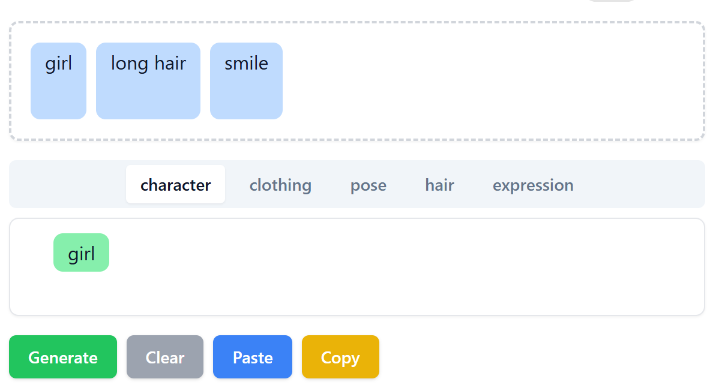
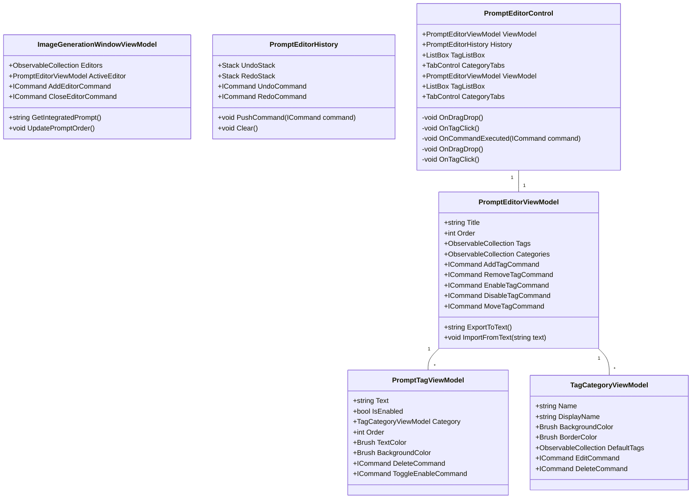

# SDプロンプト編集UI仕様

## 概要
このUIはStable Diffusionのプロンプトを管理・編集するためのツール。
プロンプトをカテゴリごとに分類し、視覚的かつ直感的に編集できるようにする。

## ラフスケッチ



## 構成

### 1. **プロンプト表示エリア（画面上部）**
- **機能**:
  - 現在のプロンプトをタグ形式で表示する
  - タグの順番をドラッグ&ドロップで変更可能
  - 任意の位置で新規タグを追加
  - タグをクリックで選択し、削除や無効化が可能
  - タブで上記の編集モード、テキスト表示の２つが切り替えられる

### 2. **ディクショナリーエリア（画面下部）**
- **機能**:
  - 各プロンプトのカテゴリごとにタブで分類
  - 登録済みのタグを表示・編集・削除可能
  - タグを他のカテゴリへ移動可能
  - カテゴリごとに固有の色を設定（プロンプトエリアでの背景色に反映）

### 3. **操作ボタン**
- **Generate（生成）**: 設定されたプロンプトを用いて画像を生成
- **Clear（クリア）**: 現在のプロンプトをすべて削除
- **Paste（ペースト）**: クリップボードのテキストをプロンプトとして追加
- **Copy（コピー）**: 現在のプロンプトをクリップボードへコピー

## カテゴリ一覧
- **キャラクター（Character）**
- **服装（Clothing）**
- **動作（Pose）**
- **髪型（Hair）**
- **表情（Expression）**

## UIの挙動
- タグをクリックすると選択状態になり、削除や無効化が可能
- 無効化されたタグはグレーアウト表示
- タグの順番をドラッグ＆ドロップで変更可能
- タブでカテゴリを切り替えてプロンプトを選択・追加可能

## その他
- UIのデザインはシンプルで直感的に操作できるようにする
- タグの色分けによってカテゴリが分かりやすくなるよう設計
- DnD（ドラッグ&ドロップ）を活用し、操作の負担を軽減

## 実装・設計

### システムアーキテクチャ



### データ構造

1. プロンプトデータ
```json
{
    "tags": [
        {
            "text": "1girl",
            "category": "Character",
            "isEnabled": true,
            "order": 0
        }
    ],
    "categories": [
        {
            "name": "Character",
            "displayName": "キャラクター",
            "backgroundColor": "#FFE0E0",
            "borderColor": "#FF0000",
            "defaultTags": [
                "1girl", "smile", "looking_at_viewer"
            ]
        }
    ]
}
```

### 主要機能の実装方針

1. **タグの管理**
   - ドラッグ&ドロップ機能はListBoxのItemsSourceをIObservableCollection<T>で実装
   - タグの順序変更はCollectionViewを使用して管理
   - 無効化されたタグはOpacityとTextColorで表現

2. **カテゴリ管理**
   - カテゴリ設定はJSON形式で保存
   - カテゴリごとの色設定はResourceDictionaryで管理
   - カテゴリタブはTabControlで実装

3. **Undo/Redo機能**
   - 各PromptEditorControlインスタンスが独自のPromptEditorHistoryを保持
   - 操作履歴はエディタごとに独立して管理
   - 履歴はStackで管理
   - コマンド実行時にOnCommandExecutedで履歴に追加

4. **インポート/エクスポート**
   - テキスト形式とJSON形式の両方をサポート
   - クリップボード操作はDataObjectを使用
   - ドラッグ&ドロップでのインポートも対応

5. **統合プロンプト生成**
   - ImageGenerationWindowViewModelで全エディタのプロンプトを統合
   ```csharp
   public string GetIntegratedPrompt()
   {
       return string.Join(", ",
           Editors.OrderBy(e => e.Order)
                 .SelectMany(e => e.Tags
                     .Where(t => t.IsEnabled)
                     .OrderBy(t => t.Order)
                     .Select(t => t.Text)));
   }
   ```
   - エディタの順序制御
   ```csharp
   public void UpdatePromptOrder()
   {
       int order = 0;
       foreach (var editor in Editors)
       {
           editor.Order = order++;
       }
   }
   ```
