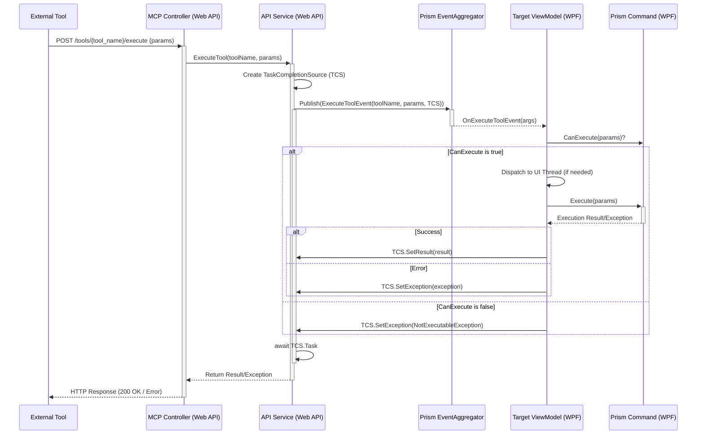

# MCP (Model Content Protocol) 対応設計書

## 1. はじめに

### 1.1. 目的

本ドキュメントは、Illustra アプリケーション (WPF) を Model Content Protocol (MCP) に対応させ、外部ツール (例: Cline) から REST API を介してアプリケーションの機能を呼び出せるようにするための設計を定義します。具体的には、Prism コマンドの実行を EventAggregator を介して実現することを目指します。

### 1.2. 背景

Illustra は .NET 9 WPF と Prism フレームワークで構築されています。MCP に対応することで、外部ツールとの連携を強化し、アプリケーションの自動化や拡張性を向上させます。

### 1.3. 設計方針

*   既存の Prism フレームワーク (特に EventAggregator) を最大限に活用します。
*   WPF アプリケーションと Web API 間の結合度を低く保ちます。
*   段階的な導入を考慮し、既存コードへの影響を最小限に抑えます。
*   将来的な機能拡張に対応できる柔軟な設計を目指します。

## 2. アーキテクチャ概要

Illustra アプリケーション内に ASP.NET Core Web API を Kestrel サーバーでホストします。この Web API が MCP のエンドポイントを提供し、受け取ったリクエストに応じて Prism の EventAggregator を介して Illustra アプリケーション内部の処理（主に Prism コマンドの実行）をトリガーします。

```mermaid
graph LR
    subgraph External Tool [外部ツール (例: Cline)]
        direction LR
        Client[HTTP Client]
    end

    subgraph Illustra Application (WPF)
        direction LR
        subgraph Embedded Web API [ASP.NET Core on Kestrel]
            direction TB
            MCPController[MCP Controller] -- Handles HTTP Requests --> APIService[API Service]
        end

        subgraph Core Logic
            direction TB
            ViewModel[ViewModels] -- Uses --> PrismCommands[Prism Commands]
            ViewModel -- Uses --> Services[Other Services]
            EventAggregator[(Prism EventAggregator)]
        end

        APIService -- Publishes event --> EventAggregator
        ViewModel -- Subscribes to --> EventAggregator
    end

    Client -- HTTP Request (e.g., /tools/execute) --> MCPController
    MCPController -- Returns HTTP Response --> Client
```

## 3. 主要コンポーネント

*   **ASP.NET Core Web API プロジェクト (`Illustra.MCPHost`):**
    *   Illustra ソリューション内に新規作成します。
    *   ターゲットフレームワーク: `net9.0`
    *   Kestrel を Web サーバーとして使用します。
    *   `Illustra` プロジェクトを参照します。
    *   `Microsoft.AspNetCore.OpenApi` 等、API関連の NuGet パッケージを追加します。
*   **MCP Controller (`McpController.cs`):**
    *   `Illustra.MCPHost` プロジェクト内に作成します。
    *   MCP の規約に準拠したエンドポイントを定義します (例: `/tools`, `/resources`)。
    *   Illustra の機能を呼び出すためのカスタムエンドポイント (例: `/tools/{tool_name}/execute`) を実装します。
    *   `APIService` を DI で注入して利用します。
*   **API Service (`ApiService.cs`):**
    *   `Illustra.MCPHost` プロジェクト内に作成します (または共有ライブラリ)。
    *   Web API と WPF アプリケーション間の連携を担当します。
    *   `IEventAggregator` を DI で注入して利用します。
    *   コントローラーから呼び出され、リクエスト内容に基づいて適切なイベントを発行します。
    *   コマンド実行結果を非同期に待機し、コントローラーに返却する役割も担います。
    *   DI コンテナにシングルトンとして登録します。
*   **Prism EventAggregator (`IEventAggregator`):**
    *   Prism 標準のイベントバス。Web API 側と WPF 側で同じインスタンスを共有します。
*   **WPF アプリケーション (`Illustra`):**
    *   **`App.xaml.cs`:**
        *   `OnStartup`: Web API ホスト (Kestrel) を起動します。`ConfigureServices` で `Illustra.MCPHost` のサービス (Controller, ApiService) や共有サービス (`IEventAggregator`) を DI コンテナに登録します。
        *   `OnExit`: Web API ホストを停止します。
    *   **ViewModels/Services:**
        *   `IEventAggregator` を介して `APIService` から発行されたイベントを購読します。
        *   イベント受信時に、対応する Prism コマンドの `CanExecute` を確認し、UI スレッドで `Execute` を実行します。
        *   実行結果 (成功/失敗、メッセージ、データ等) をイベントに含まれるコールバック機構 (例: `TaskCompletionSource`) を使って `APIService` に通知します。

## 4. Prism コマンド実行フロー (EventAggregator 利用)

1.  **イベント定義:** コマンド実行要求と結果通知のためのイベントクラスを定義します。
    ```csharp
    // 例: コマンド実行要求イベント
    public class ExecuteToolEvent : PubSubEvent<ExecuteToolEventArgs> { }

    public class ExecuteToolEventArgs
    {
        public string ToolName { get; set; } // 実行するツール/コマンド名
        public JObject Parameters { get; set; } // コマンドパラメータ (JSON形式)
        public TaskCompletionSource<object> ResultCompletionSource { get; set; } // 結果通知用
        public CancellationToken CancellationToken { get; set; } // キャンセル用
    }
    ```
2.  **リクエスト受信 (MCP Controller):** 外部ツールから `/tools/{tool_name}/execute` のようなエンドポイントに POST リクエストが送信されます (リクエストボディにパラメータを含む)。
3.  **イベント発行 (APIService):**
    *   コントローラーは `APIService` のメソッドを呼び出します。
    *   `APIService` は `TaskCompletionSource<object>` を生成します。
    *   `ExecuteToolEvent` を生成し、ツール名、パラメータ、`TaskCompletionSource` を設定して `IEventAggregator.GetEvent<ExecuteToolEvent>().Publish()` を呼び出します。
    *   `TaskCompletionSource.Task` を `await` して結果を待ちます。
4.  **イベント受信 (ViewModel/Service):**
    *   対象の ViewModel または Service は `ExecuteToolEvent` を購読しています。
    *   イベントハンドラ内で、`ToolName` に基づいて実行すべき `DelegateCommand` を特定します。
5.  **コマンド実行 (ViewModel/Service):**
    *   `CanExecute()` を確認します。実行不可の場合は `ResultCompletionSource.SetException()` でエラーを通知します。
    *   UI スレッドが必要な場合は `Application.Current.Dispatcher.InvokeAsync()` を使用します。
    *   `Execute()` を呼び出します。パラメータは `ExecuteToolEventArgs.Parameters` から取得・変換します。
    *   コマンドの実行結果 (同期または非同期) を取得します。
6.  **結果通知 (ViewModel/Service):**
    *   コマンド実行が成功したら、結果を `ResultCompletionSource.SetResult()` で設定します。
    *   コマンド実行中にエラーが発生したら、`ResultCompletionSource.SetException()` で例外を設定します。
7.  **レスポンス返却 (APIService & Controller):**
    *   `APIService` の `await TaskCompletionSource.Task` が完了します。
    *   結果または例外をコントローラーに返します。
    *   コントローラーは結果に基づいて適切な HTTP レスポンス (200 OK, 4xx/5xx Error) を生成し、外部ツールに返却します。



## 5. スレッド管理

*   Web API (Kestrel) はリクエストをバックグラウンドスレッドで処理します。
*   WPF の UI 要素にアクセスする必要がある Prism コマンドは、イベントを購読する ViewModel/Service 内で `Application.Current.Dispatcher.InvokeAsync()` を使用して UI スレッドで実行する必要があります。
*   `APIService` は UI スレッドを意識しません。

## 6. Web API ホスティング

*   `Illustra/App.xaml.cs` の `OnStartup` で `Microsoft.Extensions.Hosting` を使用して Web API ホストを構築・起動します。
    ```csharp
    // App.xaml.cs (抜粋)
    private IHost? _mcpHost;

    protected override async void OnStartup(StartupEventArgs e)
    {
        base.OnStartup(e);

        _mcpHost = Host.CreateDefaultBuilder()
            .ConfigureWebHostDefaults(webBuilder =>
            {
                webBuilder.UseStartup<Illustra.MCPHost.Startup>(); // MCPHostプロジェクトのStartupクラスを指定
                webBuilder.UseKestrel(options =>
                {
                    options.ListenLocalhost(5149); // 実際のポート番号
                });
            })
            .ConfigureServices((hostContext, services) =>
            {
                // WPF側のサービスをDIコンテナに登録 (EventAggregatorなど)
                services.AddSingleton<IEventAggregator>(Container.Resolve<IEventAggregator>());
                // 必要に応じて他の共有サービスも登録
            })
            .Build();

        await _mcpHost.StartAsync();

        // ... 他の初期化処理 ...
    }

    protected override async void OnExit(ExitEventArgs e)
    {
        if (_mcpHost != null)
        {
            await _mcpHost.StopAsync();
            _mcpHost.Dispose();
        }
        base.OnExit(e);
    }
    ```
*   `Illustra.MCPHost` プロジェクトに `Startup.cs` を作成し、ASP.NET Core の設定 (DI、ルーティング、コントローラー登録など) を行います。WPF 側から共有されるサービス (`IEventAggregator`) もここで利用できるように設定します。

## 7. API エンドポイント定義

Illustra の機能は OpenAPI 3.0 仕様に準拠した REST API として公開されます。API 仕様は以下のエンドポイントから取得できます。

*   **GET /api/v1/openapi.json:**
*   サーバーが提供する API の詳細な仕様を OpenAPI 3.0 形式 (JSON) で返します。JSON はマシン間の相互運用性に優れています。
*   この仕様には、各エンドポイント (ツール/リソースに対応)、HTTP メソッド、パラメータ、リクエスト/レスポンスのスキーマ、そして LLM が理解しやすいように自然言語での説明 (目的、使用例など) が含まれます。
*   仕様は `Swashbuckle.AspNetCore` ライブラリと XML ドキュメントコメントを用いて自動生成されます。
*   Swagger UIは `/api/swagger` で利用可能です。

**公開される主な API (OpenAPI 仕様内で定義):**

OpenAPI 仕様には、以下のような操作や情報取得に対応するエンドポイントが含まれます。具体的なパスやパラメータ構造は OpenAPI 仕様で定義されます。

*   **操作系 API (例: POST /api/execute/open_folder):**
    *   `open_folder`, `select_file`, `set_rating`, `filter_by_rating`, `clear_rating_filter`, `sort_thumbnails`, `show_image_viewer`, `close_image_viewer`, `navigate_image`, `toggle_fullscreen`, `toggle_properties_panel`, `filter_by_tag`, `clear_tag_filter`, `set_theme` など。
    *   リクエストボディでパラメータを受け取ります。
*   **情報取得系 API (例: GET /api/info/current_folder):**
    *   `get_prompt_info`, `get_current_folder`, `get_selected_files`, `get_files_in_view` など。
    *   必要に応じてクエリパラメータで引数を受け取ります。
*   **リソース API (将来的な拡張):**
    *   アプリケーション内の特定データ (設定、履歴など) をリソースとして公開するためのエンドポイント (例: `GET /api/resources/settings`)。

**API 命名規則:**
エンドポイントのパスは以下の形式で実装されています：
- 操作系: `/api/execute/{toolName}`
- 情報取得系: `/api/info/{toolName}`

例:
- `/api/execute/test-tool`
- `/api/info/test-tool`

これにより、OpenAPI 仕様が整理され、理解しやすくなります。
エンドポイントのパスは、操作 (`execute`)、情報取得 (`info`)、リソース (`resources`) などのカテゴリでグループ化し、その後に具体的なアクション名 (`open_folder` など) を続ける形式を検討します (例: `/api/execute/open_folder`, `/api/info/current_folder`)。これにより、OpenAPI 仕様が整理され、理解しやすくなります。最終的なパスは実装時に決定します。

## 8. 段階的な実装計画

既存アプリケーションへの影響を最小限に抑えつつ、段階的に MCP 対応を進めます。

1.  **ステップ1: Web API ホスティング基盤の構築**
    *   **目的:** Illustra アプリケーション内で ASP.NET Core Web API (Kestrel) が起動し、基本的なリクエストに応答できるようにする。
    *   **作業内容:**
        *   `Illustra.MCPHost` プロジェクト (ASP.NET Core Web API) をソリューションに追加。
        *   `Illustra` プロジェクトから `Illustra.MCPHost` を参照。
        *   `Illustra/App.xaml.cs` に Web API ホストの起動・停止処理を追加 (ポートは仮設定)。
        *   `Illustra.MCPHost/Startup.cs` (または `Program.cs`) で基本的な ASP.NET Core 設定 (ルーティング、コントローラー有効化)。
        *   `IEventAggregator` を両プロジェクト間で共有するための DI 設定。
        *   `Illustra.MCPHost` に `APIService` と `McpController` の雛形を作成。
    *   **確認:** Illustra 起動時に Web API が指定ポートで Listen し、ブラウザ等からルートパス (`/`) にアクセスして応答があることを確認。

2.  **ステップ2: OpenAPI 仕様の導入**
    *   **目的:** API 仕様を自動生成し、公開するための仕組みを導入する。
    *   **作業内容:**
        *   `Illustra.MCPHost` に `Swashbuckle.AspNetCore` NuGet パッケージを追加。
        *   `Startup.cs` (または `Program.cs`) で OpenAPI 仕様生成と Swagger UI を有効化。
        *   `Illustra.MCPHost` プロジェクトで XML ドキュメント生成を有効化。
    *   **確認:** Illustra 起動後、ブラウザから `/api/openapi.json` (または `/swagger/v1/swagger.json`) と `/swagger` にアクセスできることを確認。

3.  **ステップ3: 最初の情報取得コマンド実装 (`get_current_folder`)**
    *   **目的:** 最初の MCP ツールを実装し、Web API から WPF アプリケーションの状態を取得する連携を確認する。
    *   **作業内容:**
        *   関連イベント (`GetCurrentFolderEvent` など) を定義。
        *   WPF 側でイベントを購読し、現在のフォルダパスを取得して結果を返す処理を追加 (ViewModel など)。
        *   `APIService` に `GetCurrentFolderAsync` メソッドを実装 (イベント発行と結果待機)。
        *   `McpController` に `GET /api/info/current_folder` エンドポイントを追加し、`APIService` を呼び出す。XML ドキュメントコメントを記述。
    *   **確認:** Swagger UI や curl などから `GET /api/info/current_folder` を実行し、Illustra で開いているフォルダのパスが正しく返されることを確認。

4.  **ステップ4: 最初の操作コマンド実装 (`open_folder`)**
    *   **目的:** Web API から WPF アプリケーションの操作を実行する連携を確認する。
    *   **作業内容:**
        *   関連イベント (`OpenFolderEvent` など) を定義。
        *   WPF 側でイベントを購読し、指定されたフォルダを開く処理を追加 (ViewModel など)。UI スレッドでの実行が必要な場合は `Dispatcher` を使用。
        *   `APIService` に `OpenFolderAsync` メソッドを実装 (イベント発行と結果待機)。
        *   `McpController` に `POST /api/execute/open_folder` エンドポイントを追加し、`APIService` を呼び出す。XML ドキュメントコメントを記述。
    *   **確認:** Swagger UI や curl などから `POST /api/execute/open_folder` を実行し、Illustra で指定したフォルダが開かれることを確認。

5.  **ステップ5以降: 他のコマンドの実装**
    *   API 命令セット素案の優先度に基づき、他のコマンド (`select_file`, `set_rating` など) をステップ3、4と同様の手順で1つずつ実装していく。
    *   実装の過程で必要に応じて既存コードのリファクタリングを行う。

## 9. 今後の課題・検討事項

*   **認証・認可:** Web API へのアクセス制御をどうするか (ローカルホスト限定、APIキーなど)。
*   **エラーハンドリング:** Web API、APIService、ViewModel/Command 間での詳細なエラー伝達方法。
*   **パラメータ形式:** コマンドパラメータの型や構造の標準化。
*   **リソース提供:** ファイル内容やアプリケーションの状態など、コマンド実行以外の情報提供 (`/resources` エンドポイント) の設計。
*   **双方向通信:** Web API から WPF へのプッシュ通知 (例: SignalR の導入検討)。
*   **ポート番号:** 使用するポート番号の決定方法 (固定、設定ファイル、動的検出など)。
