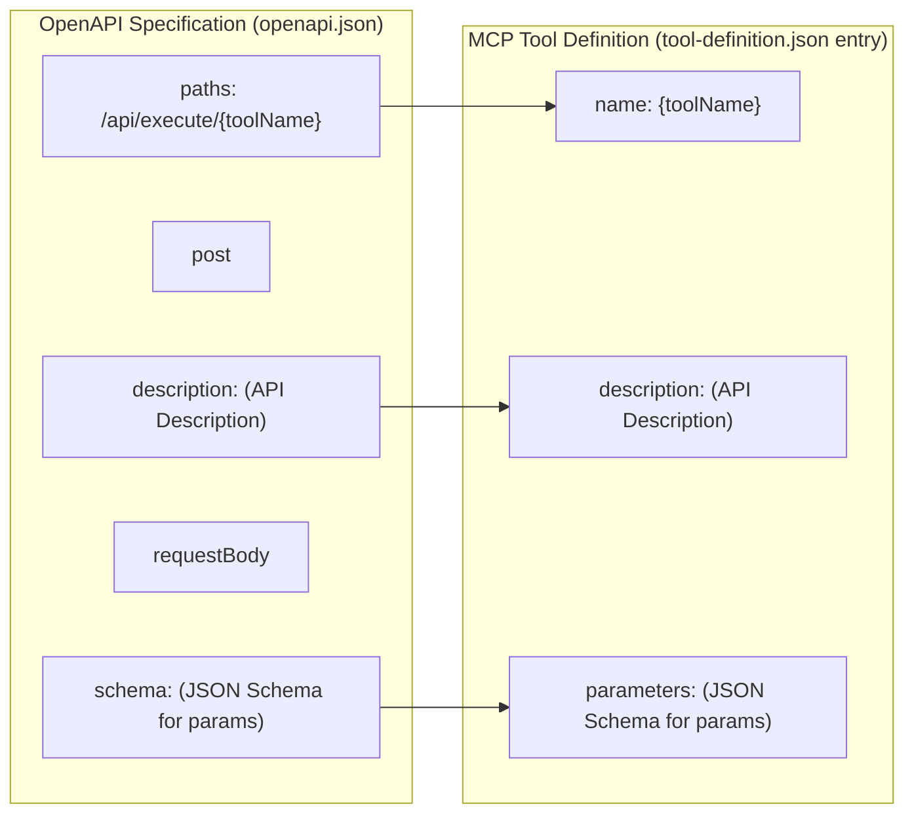
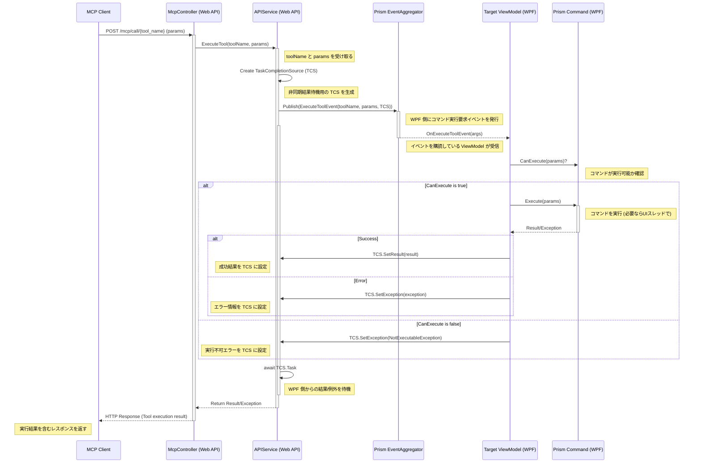

# Illustra MCP Integration Guide

## 1. 目的と対象読者

本ドキュメントは、Illustra アプリケーションが提供する Model Content Protocol (MCP) 対応の REST API を利用する開発者、特に MCP クライアント (例: Cline) の開発者を対象としています。Illustra の機能を外部からプログラムで制御するためのインターフェース仕様と利用方法について解説します。

## 2. MCP サーバーとしての Illustra

Illustra は、内部に ASP.NET Core Web API をホストし、MCP サーバーとして機能します。以下の標準的な MCP エンドポイントを提供します。

*   **`GET /mcp/tool-definition`**:
    *   Illustra が提供する利用可能なツールの一覧を JSON 形式 (MCP Tool Definition Format) で返します。クライアントはこの情報を利用して、ユーザーに提示する機能や、LLM が呼び出し可能な関数を決定します。
*   **`POST /mcp/call/{tool_name}`**:
    *   指定された `{tool_name}` のツールを実行します。リクエストボディには、ツールが必要とするパラメータを JSON オブジェクトとして含めます。実行結果はレスポンスボディで返されます。

これらのエンドポイントは、Illustra アプリケーションの起動時に指定されたポート (例: `http://localhost:5149`) で公開されます。

## 3. ツール定義 (`tool-definition.json`) の生成戦略

Illustra は、既存の OpenAPI 仕様 (`/api/v1/openapi.json`) をソースとして、MCP クライアントが必要とする `tool-definition.json` の内容を動的に生成します。これにより、API 仕様と MCP ツール定義の一貫性を保ちます。

変換の基本的なマッピングルールは以下の通りです。



*   **`name`**: OpenAPI のパス `/api/execute/{toolName}` から `{toolName}` 部分を抽出して設定します。情報取得系の API (`/api/info/{toolName}`) も同様にツールとして定義可能です。
*   **`description`**: OpenAPI の `post` (または `get`) 操作の `description` をそのままコピーします。**この説明は LLM がツールの機能と利用場面を理解し、適切に選択するために非常に重要です。** 明確で、具体的、かつ LLM が解釈しやすい自然言語で記述する必要があります。
*   **`parameters`**: OpenAPI の `requestBody` (POST の場合) または `parameters` (GET の場合) で定義された JSON Schema をそのままコピーします。これにより、クライアントや LLM はツール呼び出しに必要な引数の型、必須/任意、説明を正確に把握できます。

**注意:** 現在の設計 (`docs/MCP_Design.md`) では OpenAPI エンドポイントは `/api/execute/{toolName}` や `/api/info/{toolName}` ですが、MCP エンドポイントは `/mcp/call/{tool_name}` です。ツール名は OpenAPI のパスから抽出されたものが使用されます。

## 4. ツール実行 (`/mcp/call/{tool_name}`) の処理フロー

MCP クライアントが `POST /mcp/call/{tool_name}` を呼び出すと、Illustra 内部では以下のフローで処理が実行されます。



このフローにより、外部からの HTTP リクエストが、WPF アプリケーション内部の Prism コマンド実行に繋がり、その結果が非同期に返却されます。

## 5. API 設計のベストプラクティス (MCP 観点)

MCP クライアントや LLM との連携をスムーズにするために、以下の点に留意して API (ひいてはツール) を設計することが推奨されます。

*   **パラメータ定義は「型 + 説明」を明確に:**
    *   OpenAPI 仕様のスキーマ定義において、各パラメータの `type` (例: `string`, `integer`, `boolean`) を正確に指定し、`description` にはそのパラメータが何を表すのか、どのような値を期待するのかを自然言語で具体的に記述します。
    *   例:
        ```json
        "parameters": {
          "type": "object",
          "properties": {
            "folderPath": {
              "type": "string",
              "description": "開きたいフォルダのフルパス (例: 'C:\\Users\\MyUser\\Pictures')"
            }
          },
          "required": ["folderPath"]
        }
        ```
    *   これにより、LLM はパラメータの意味を理解しやすくなり、ユーザーの指示から適切な値を推論して設定できるようになります。また、クライアントはバリデーションを実装しやすくなります。
*   **ツール (関数) としての抽象化:**
    *   Illustra 内部の実装 (Prism コマンド) とは別に、外部に公開する機能を「ツール」として捉え、それぞれに明確な `name` と `description`、そして `parameters` を定義するアプローチは、MCP との親和性が高いです。
    *   この考え方に基づき、OpenAPI 仕様を設計・記述することで、`tool-definition.json` の自動生成やメンテナンスが容易になります。
*   **`description` の質が重要:**
    *   前述の通り、ツールの `description` は LLM がそのツールをいつ、どのように使うべきかを判断するための最も重要な情報源です。
    *   単なる機能名だけでなく、「何をするためのツールか」「どのような状況で役立つか」「パラメータは何を意味するか」などを具体的に記述します。

これらのベストプラクティスに従うことで、Illustra の機能を MCP を介してより効果的に外部から利用できるようになります。
