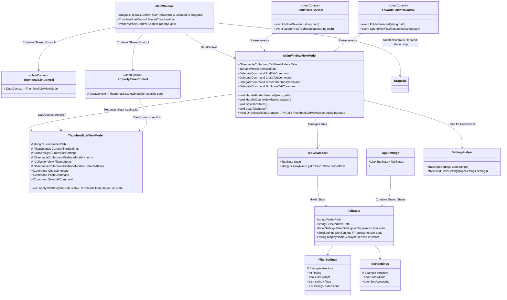

# サムネイル一覧タブ機能 実装計画

## 1. 目的

サムネイル一覧表示をタブで管理できるようにする。各タブは独立したフォルダパス、フィルタ設定、ソート設定、選択状態を保持する。

## 2. 設計方針

*   **タブ状態管理:** `MainWindowViewModel` がタブ (`TabViewModel` のコレクション) を管理する。各 `TabViewModel` はタブの状態 (`TabState`) を保持する。
*   **データ表示:** `ThumbnailListViewModel` (シングルトン) が引き続きサムネイルデータの読み込み、フィルタリング、ソートを担当する。タブが切り替わるたびに、`MainWindowViewModel` が `ThumbnailListViewModel` に対して、アクティブになったタブの `TabState` を適用するように指示する (`ApplyTabState` メソッド呼び出し)。これにより、`ThumbnailListViewModel` が管理するデータが更新され、UIに反映される。
*   **UI:** `Dragablz` ライブラリの `TabablzControl` を使用して、ドラッグ＆ドロップによるタブの並び替えを可能にする。サムネイルリスト (`ThumbnailListControl`) とプロパティパネル (`PropertyPanelControl`) はウィンドウで共有され、`ThumbnailListViewModel` の状態変更に応じて表示内容が更新される。
*   **永続化:** タブの状態 (`List<TabState>`) は `AppSettings` を介してJSONファイルに保存・復元する。

## 3. クラス図 (Mermaid)

## 4. 実装ステップ (チェックリスト・動作確認付き)

以下の順序で実装を進め、各ステップ完了後にチェックを入れ、指定されたポイントで動作確認を行います。

1.  [ ] **ライブラリ導入:** `Dragablz` をプロジェクトに追加します。
    *   [ ] 1.1. NuGet パッケージ マネージャーを使用して `Dragablz` ライブラリを `Illustra.csproj` に追加します。
2.  [ ] **モデル定義:** `TabState`, `FilterSettings`, `SortSettings` モデルクラスを定義します。
    *   [ ] 2.1. `src/Models/` に `TabState.cs` を作成し、プロパティ (FolderPath, SelectedItemPath, FilterSettings, SortSettings など) を定義します。
    *   [ ] 2.2. `src/Models/` に `FilterSettings.cs` と `SortSettings.cs` を作成し、それぞれの設定項目を定義します。
3.  [ ] **ViewModel定義:** `TabViewModel` クラスを定義します。
    *   [ ] 3.1. `src/ViewModels/` に `TabViewModel.cs` を作成し、`TabState` を保持するプロパティと表示名 (`DisplayName`) プロパティを定義します。
4.  [ ] **MainWindowViewModel変更 (基本):** `Tabs`, `SelectedTab` プロパティ、タブ操作コマンドの基本形を追加します。
    *   [ ] 4.1. `src/ViewModels/MainWindowViewModel.cs` を変更:
        *   [ ] 4.1.1. `ObservableCollection<TabViewModel> Tabs { get; }` プロパティを追加します。
        *   [ ] 4.1.2. `TabViewModel SelectedTab { get; set; }` プロパティ (INotifyPropertyChanged 実装) を追加します。
        *   [ ] 4.1.3. タブ追加 (`AddTabCommand`)、削除 (`CloseTabCommand`)、他削除 (`CloseOtherTabsCommand`)、複製 (`DuplicateTabCommand`) の `DelegateCommand` プロパティを定義します (実装は後述)。
5.  [ ] **ThumbnailListViewModel変更:** `ApplyTabState` メソッドを追加します。
    *   [ ] 5.1. `src/ViewModels/ThumbnailListViewModel.cs` を変更:
        *   [ ] 5.1.1. `public void ApplyTabState(TabState state)` メソッドを追加します。このメソッド内で、引数の `state` に基づき `CurrentFolderPath`, フィルタ設定、ソート設定を更新し、フォルダアイテムを再読み込みするロジックを実装します。
6.  [ ] **UI変更 (基本):** `MainWindow.xaml` に `Dragablz:TabablzControl` を配置し、`ItemsSource` と `SelectedItem` をバインドします。共有コントロールはそのままにします。
    *   [ ] 6.1. `src/Views/MainWindow.xaml` を変更:
        *   [ ] 6.1.1. `Dragablz` の名前空間 (`xmlns:dragablz="http://dragablz.net/"`) を追加します。
        *   [ ] 6.1.2. 右側ペインのコンテンツ表示領域に `dragablz:TabablzControl` を配置します。
        *   [ ] 6.1.3. `ItemsSource="{Binding Tabs}"` と `SelectedItem="{Binding SelectedTab, Mode=TwoWay}"` を設定します。
        *   [ ] 6.1.4. `ThumbnailListControl` と `PropertyPanelControl` は `TabablzControl` の外側の適切な場所に配置されたままにします。
    *   **動作確認ポイント 1:** アプリケーションを起動し、タブが表示されること、タブヘッダーが表示されること（まだダミーデータや空でも可）、タブの追加/削除（まだ機能しないコマンドでも可）でエラーが出ないことを確認します。ドラッグでの並び替えが可能になっていることを確認します。
7.  [ ] **タブ切り替え連携:** `MainWindowViewModel` で `SelectedTab` の変更を検知し、`ThumbnailListViewModel.ApplyTabState` を呼び出す処理を実装します。
    *   [ ] 7.1. `MainWindowViewModel` の `SelectedTab` プロパティの setter 内、または `PropertyChanged` イベントハンドラで、`SelectedTab` の変更を検知し、`_thumbnailListViewModel.ApplyTabState(SelectedTab.State)` を呼び出す処理を追加します。（`_thumbnailListViewModel` は適切に注入または解決されている必要があります）
    *   **動作確認ポイント 2:** 複数のタブを手動で（デバッグ等で）作成し、タブを切り替えると `ThumbnailListViewModel` の `ApplyTabState` が呼び出され、対応するフォルダのサムネイルリストが表示されることを確認します。
8.  [ ] **フォルダ選択連携:** フォルダツリー/お気に入りからのフォルダ選択で、アクティブタブの状態を更新し `ApplyTabState` を呼び出す処理を実装します。
    *   [ ] 8.1. `FolderTreeControl` と `FavoriteFoldersControl` からのフォルダ選択イベントを処理するメソッド (`MainWindowViewModel.HandleFolderSelected`) を修正:
        *   [ ] 8.1.1. `SelectedTab` が null でないことを確認します。
        *   [ ] 8.1.2. `SelectedTab.State.FolderPath` を選択されたパスで更新します。
        *   [ ] 8.1.3. `_thumbnailListViewModel.ApplyTabState(SelectedTab.State)` を呼び出します。
    *   **動作確認ポイント 3:** フォルダツリーやお気に入りでフォルダを選択すると、現在アクティブなタブの表示が更新され、そのフォルダのサムネイルが表示されることを確認します。
9.  [ ] **タブで開く機能:** フォルダツリー/お気に入りの右クリックメニューから新しいタブを開く機能を実装します。
    *   [ ] 9.1. `FolderTreeControl` と `FavoriteFoldersControl` の右クリックメニューに「タブで開く」を追加し、対応するイベント (`OpenInNewTabRequested`) を発生させます。
    *   [ ] 9.2. `MainWindowViewModel` に `HandleOpenInNewTab(string path)` メソッドを追加:
        *   [ ] 9.2.1. 新しい `TabState` と `TabViewModel` を作成します (フォルダパスを設定)。
        *   [ ] 9.2.2. `Tabs` コレクションに追加します。
        *   [ ] 9.2.3. `SelectedTab` を新しく作成した `TabViewModel` に設定します。
    *   **動作確認ポイント 4:** フォルダツリーやお気に入りの右クリックメニューから「タブで開く」を選択すると、新しいタブが追加され、そのタブがアクティブになり、選択したフォルダのサムネイルが表示されることを確認します。
10. [ ] **タブ操作機能:** タブの閉じる、他のタブを閉じる、複製するコマンドのロジックを実装します。
    *   [ ] 10.1. `MainWindowViewModel` でタブ操作コマンド (`CloseTabCommand`, `CloseOtherTabsCommand`, `DuplicateTabCommand`) の実行ロジックを実装します。
        *   [ ] 10.1.1. `CloseTabCommand`: 指定されたタブを `Tabs` から削除します。適切な次のタブを `SelectedTab` に設定します。
        *   [ ] 10.1.2. `CloseOtherTabsCommand`: 指定されたタブ以外を `Tabs` から削除します。指定されたタブを `SelectedTab` に設定します。
        *   [ ] 10.1.3. `DuplicateTabCommand`: 指定されたタブの `TabState` をコピーして新しい `TabViewModel` を作成し、`Tabs` に追加します。新しいタブを `SelectedTab` に設定します。
    *   **動作確認ポイント 5:** タブの右クリックメニューから「閉じる」「他のタブを閉じる」「複製」がそれぞれ正しく動作することを確認します。タブを閉じた後に適切なタブが選択され、表示が更新されることも確認します。
11. [ ] **UI変更 (詳細):** タブヘッダーの表示内容（フォルダ名など）、右クリックメニューのUIを実装します。
    *   [ ] 11.1. `src/Views/MainWindow.xaml` (続き):
        *   [ ] 11.1.1. `dragablz:TabablzControl` の `HeaderItemTemplate` を調整し、`TabViewModel.DisplayName` (フォルダ名など) を適切に表示します。
        *   [ ] 11.1.2. タブの右クリックメニュー (`ContextMenu`) の `MenuItem` に `Header` を設定し、リソースを参照するようにします。
12. [ ] **永続化:** `AppSettings` と `SettingsHelper` を変更し、タブ状態の保存・復元ロジックを実装します。
    *   [ ] 12.1. `src/Models/AppSettings.cs` に `public List<TabState> TabStates { get; set; } = new();` プロパティを追加します。
    *   [ ] 12.2. `MainWindowViewModel` に `SaveTabStates()` メソッドを追加し、アプリケーション終了処理 (例: `App.xaml.cs` の `OnExit`) から呼び出されるようにします。このメソッド内で `Tabs` コレクションから `List<TabState>` を作成し、`SettingsHelper.SaveSettings` を呼び出します。タブの順序も反映されるように `Tabs` の順序で `TabState` をリストに追加します。
    *   [ ] 12.3. `MainWindowViewModel` に `LoadTabStates()` メソッドを追加し、コンストラクタまたは初期化処理で呼び出します。`SettingsHelper.GetSettings` で `TabStates` を読み込み、`TabViewModel` を復元して `Tabs` コレクションに追加します。最後にアクティブだったタブ (必要ならこれも `AppSettings` に保存) を `SelectedTab` に設定し、`_thumbnailListViewModel.ApplyTabState` を呼び出します。
    *   **動作確認ポイント 6:** 複数のタブを開き、フィルタやソート、選択状態を変更してからアプリケーションを終了し、再起動します。タブ構成、各タブのフォルダ、フィルタ、ソート、選択状態が復元されることを確認します。
13. [ ] **リソース更新:** 必要な文言リソースを追加します。
    *   [ ] 13.1. `src/Resources/Strings.xaml` と `src/Resources/Strings.ja.xaml` に、タブの右クリックメニュー項目や「タブで開く」などの新しい文言リソースを追加します。規約に従い `String_Tab_Close`, `String_Tab_CloseOthers`, `String_Tab_Duplicate`, `String_Tab_OpenInNewTab` のようなキーを使用します。
14. [ ] **最終確認とビルド:** 全体の動作確認、最終ビルド (`dotnet build`) を行います。
    *   [ ] 14.1. 全体の動作（特にエッジケースや複数操作の組み合わせ）を再度確認します。
    *   [ ] 14.2. `docs/Implementation.md` を更新し、タブ機能に関連する新しいコンポーネント (`TabViewModel`, `TabState` など) や変更点 (`MainWindowViewModel`, `ThumbnailListViewModel`, `MainWindow.xaml` など) を反映します。
    *   [ ] 14.3. `dotnet build` を実行し、エラーや警告がないことを確認します。
