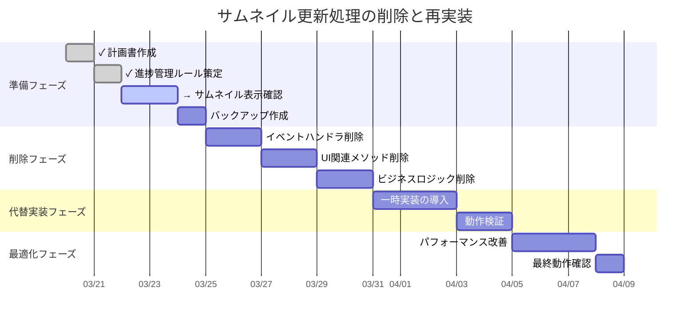

# サムネイル更新処理の削除計画

## 1. ThumbnailListControl.xaml.cs からの削除対象

### 1.1 削除するメソッド

```csharp
// フィルタ関連
private async void OnFilterChanged(FilterChangedEventArgs args)
private void UpdateFilterButtonStates(int selectedRating)
private async Task ApplyFilterling(int rating)

// ソート関連
private async void OnSortOrderChanged(SortOrderChangedEventArgs args)
private async void SortToggle_Click(object sender, RoutedEventArgs e)
private async void SortTypeToggle_Click(object sender, RoutedEventArgs e)
private async Task SortThumbnailAsync(bool sortByDate, bool sortAscending, bool selectItem = false)

// サムネイル更新関連
private async Task LoadVisibleThumbnailsAsync(ScrollViewer scrollViewer)
private async Task ProcessThumbnailLoadQueue()
private void OnScrollChanged(object sender, ScrollChangedEventArgs e)
private async Task OnWindowSizeChanged(ScrollViewer scrollViewer)
```

### 1.2 削除するフィールド

```csharp
private readonly Queue<Func<Task>> _thumbnailLoadQueue;
private readonly DispatcherTimer _thumbnailLoadTimer;
private bool _isFirstLoad;
private bool _pendingSelection;
private int _pendingSelectionIndex;
```

### 1.3 削除するイベントハンドラ登録

```csharp
// ThumbnailListControl コンストラクタから
_thumbnailLoadTimer = new DispatcherTimer { Interval = TimeSpan.FromMilliseconds(200) };
_thumbnailLoadTimer.Tick += async (s, e) => await ProcessThumbnailLoadQueue();
_thumbnailLoadTimer.Start();

// ThumbnailListControl_Loaded から
_eventAggregator.GetEvent<FilterChangedEvent>().Subscribe(OnFilterChanged);
_eventAggregator.GetEvent<SortOrderChangedEvent>().Subscribe(OnSortOrderChanged);
scrollViewer.ScrollChanged += OnScrollChanged;
window.SizeChanged += async (s, args) => await OnWindowSizeChanged(scrollViewer);
```

## 2. MainViewModel.cs からの削除対象

### 2.1 削除するメソッド

```csharp
// フィルタ関連
public async Task ApplyAllFilters(int ratingFilter, bool isPromptFilterEnabled, List<string> tagFilters, bool isTagFilterEnabled)
private void ApplyFilterAndUpdateSelection()
private bool FilterItems(object item)

// ソート関連
public async Task SortItemsAsync(bool sortByDate, bool sortAscending)
private int FindSortedInsertIndex(FileNodeModel newItem)
```

### 2.2 削除するフィールド

```csharp
private ICollectionView _filteredItems;
private bool _sortByDate;
private bool _sortAscending;
private int _currentRatingFilter;
private bool _isPromptFilterEnabled;
private readonly Dictionary<string, bool> _promptCache;
private readonly Dictionary<string, List<string>> _tagCache;
private List<string> _tagFilters;
private bool _isTagFilterEnabled;
```

## 3. 削除順序

1. イベントハンドラの登録解除
2. UI 関連のメソッド削除
3. ビジネスロジックのメソッド削除
4. フィールドとプロパティの削除

## 4. 削除時の注意点

1. 依存関係の確認

   - 削除対象のメソッドを参照している箇所の特定
   - 削除による影響範囲の確認

2. コンパイルエラーの対応

   - イベント購読箇所の修正
   - 参照箇所の一時的な代替実装

3. デグレードの防止
   - 基本機能の動作確認
   - UI 表示の確認

## 5. 一時的な代替実装

### 5.1 フィルタ機能

```csharp
// 一時的にすべての項目を表示
public async Task ApplyAllFilters(...)
{
    // 実装は空とし、すべての項目を表示
    return;
}
```

### 5.2 ソート機能

```csharp
// 一時的にファイル名順で固定
public async Task SortItemsAsync(...)
{
    var items = Items.OrderBy(x => x.FileName).ToList();
    Items.Clear();
    foreach (var item in items)
    {
        Items.Add(item);
    }
}
```

### 5.3 サムネイル更新

```csharp
// 一時的に即時読み込み
private async Task LoadVisibleThumbnailsAsync(...)
{
    // すべてのサムネイルを即時生成
    foreach (var item in Items)
    {
        await _thumbnailLoader.LoadThumbnailAsync(item);
    }
}

```

## 6. 進捗記録ルール

### 6.1 記録タイミング

- 各実行段階の完了時
- 重要な中間マイルストーン達成時
- 予期せぬ問題発生時

### 6.2 記録フォーマット

```markdown
### [日付] 進捗状況

#### 完了した作業

- 作業項目 1
- 作業項目 2

#### 次のステップ

- 予定作業 1
- 予定作業 2

#### 注意点・課題

- 課題 1
- 課題 2
```

### 6.3 記録内容

1. 完了した作業

   - 削除したコード
   - 変更した機能
   - 影響を受けた機能

2. 次のステップ

   - 次に予定している作業
   - 優先順位
   - 予想される課題

3. 注意点・課題
   - 発生した問題
   - 対応が必要な課題
   - パフォーマンスへの影響

### 6.4 記録の更新方法

1. 新しい進捗は常にファイルの末尾に追加
2. 過去の記録は修正せず、必要に応じて新しい記録で補足
3. 重要な変更は太字で強調

## 7. 進捗記録

### [2024-03-21] 進捗状況

#### 完了した作業

- 進捗記録ルールの追加
- 既存機能の動作確認

#### 次のステップ

- ThumbnailListControl.xaml.cs からのイベントハンドラ登録解除
- UI 関連メソッドの削除準備
- 依存関係の最終確認

#### 注意点・課題

- 現時点で画面の見た目に変化なし（想定通り）
- イベントハンドラ削除前の依存関係の詳細な確認が必要
- 削除作業開始前のバックアップ作成が必要

## 8. 全体ロードマップと進捗状況

### 8.1 フェーズと進捗



### 8.2 現在の状況

- **現在のフェーズ**: 準備フェーズ
- **完了したマイルストーン**:
  - ✓ 削除計画の策定
  - ✓ 進捗管理ルールの確立
- **進行中の作業**:
  - → サムネイル表示機能の動作確認
- **次のマイルストーン**: バックアップ作成

### 8.3 残作業の概要

1. 準備フェーズの残作業（予定工数: 3 日）

   - サムネイル表示機能の動作確認と修正
   - バックアップ作成

2. 削除フェーズ（予定工数: 6 日）

   - イベントハンドラ削除
   - UI 関連メソッド削除
   - ビジネスロジック削除

3. 代替実装フェーズ（予定工数: 5 日）

   - 一時実装の導入
   - 動作検証

4. 最適化フェーズ（予定工数: 4 日）
   - パフォーマンス改善
   - 最終動作確認

### [2024-03-21] 進捗状況 その 2

#### 完了した作業

- ロードマップの優先順位修正
- サムネイル表示確認フェーズの追加

#### 次のステップ

- サムネイル表示機能の動作確認
- 必要に応じてサムネイル表示処理の修正
- サムネイル生成処理のデバッグ

#### 注意点・課題

- サムネイル表示が機能していない可能性あり
- 表示機能の確認が最優先
- デバッグ作業が必要な可能性あり
