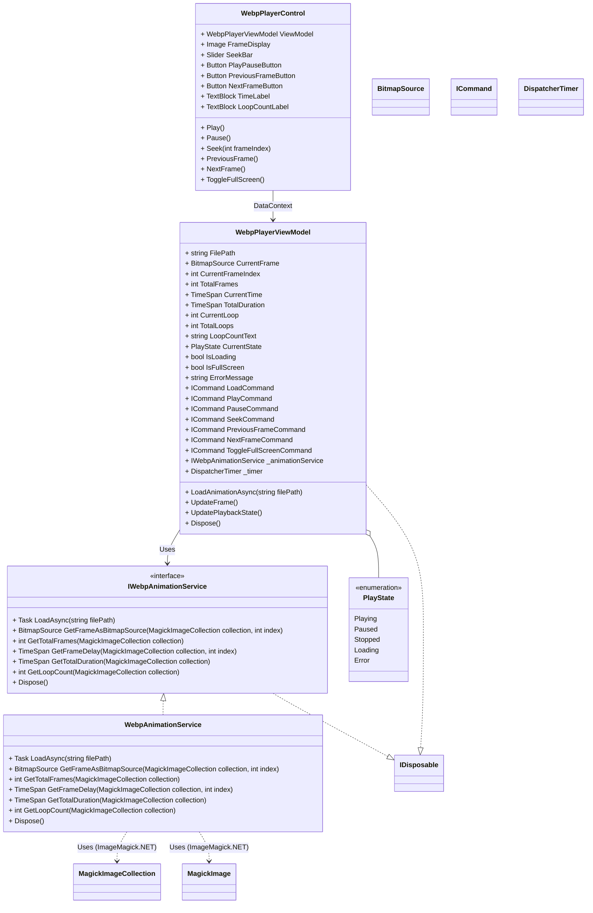

# WebP アニメーション再生コンポーネント 設計案 (承認版)

## 1. 概要

ImageMagick.NET を利用して、MP4 動画再生のようにシーク、一時停止、再開、コマ送り/戻しが可能な WebP アニメーション再生コンポーネントを作成する。既存の `VideoPlayerControl` を参考にしつつ、WebP 特有のループ回数表示やフレームベースの制御を追加する。フルスクリーン表示にも対応する。

## 2. コンポーネント構成

### 2.1. `WebpPlayerControl.xaml` / `.xaml.cs` (View)

*   **場所:** `src/Controls/`
*   **ベース:** `VideoPlayerControl.xaml` のレイアウトを参考にする。
*   **表示要素:**
    *   `Image` コントロール: 現在のフレームを表示 (`ViewModel.CurrentFrame` にバインド)。
    *   `Slider` (`SeekBar`): 再生位置の表示とシーク操作。
    *   `Button` (`PlayPauseButton`): 再生/一時停止の切り替え。
    *   `Button` (`PreviousFrameButton`): コマ戻し。
    *   `Button` (`NextFrameButton`): コマ送り。
    *   `TextBlock` (`TimeLabel`): `現在時間 / 総時間` を表示。
    *   `TextBlock` (`LoopCountLabel`): `(現在のループ / 総ループ数)` を表示 (無限ループ時は `(ループ中 / ∞)`)。
*   **機能:**
    *   フルスクリーン表示切り替え機能 (`ToggleFullScreen`)。
    *   ViewModel のコマンド (Play, Pause, Seek, PreviousFrame, NextFrame) をトリガーするイベントハンドラ。
    *   ViewModel のプロパティ (`IsFullScreen`, `IsLoading`, `ErrorMessage` など) に基づいて UI 状態を更新。

### 2.2. `WebpPlayerViewModel.cs` (ViewModel)

*   **場所:** `src/ViewModels/`
*   **インターフェース:** `INotifyPropertyChanged`, `IDisposable`
*   **プロパティ:**
    *   `FilePath` (string): 読み込む WebP ファイルのパス。
    *   `CurrentFrame` (BitmapSource): 表示する現在のフレーム画像。
    *   `CurrentFrameIndex` (int): 現在のフレーム番号 (0ベース)。
    *   `TotalFrames` (int): 総フレーム数。
    *   `CurrentTime` (TimeSpan): 現在の再生時間。
    *   `TotalDuration` (TimeSpan): アニメーション全体の総再生時間。
    *   `CurrentLoop` (int): 現在のループ回数 (1ベース)。
    *   `TotalLoops` (int): 総ループ回数 (0 は無限ループ)。
    *   `LoopCountText` (string): UI 表示用のループ回数テキスト (例: `(1 / 5)`, `(ループ中 / ∞)`)。
    *   `CurrentState` (PlayState): 再生状態 (Playing, Paused, Stopped, Loading, Error)。
    *   `IsLoading` (bool): ファイル読み込み/処理中フラグ。
    *   `IsFullScreen` (bool): フルスクリーン表示状態フラグ。
    *   `ErrorMessage` (string): エラー発生時のメッセージ。
*   **コマンド (ICommand):**
    *   `LoadCommand`: ファイルパスを指定してアニメーションを読み込む。
    *   `PlayCommand`: 再生を開始/再開する。
    *   `PauseCommand`: 再生を一時停止する。
    *   `SeekCommand`: 指定された時間またはフレームにシークする。
    *   `PreviousFrameCommand`: 1 フレーム戻る。
    *   `NextFrameCommand`: 1 フレーム進む。
    *   `ToggleFullScreenCommand`: フルスクリーン表示を切り替える。
*   **依存関係:** `IWebpAnimationService`
*   **内部ロジック:**
    *   `DispatcherTimer` を使用してフレーム更新と時間経過を管理。
    *   `IWebpAnimationService` を介して WebP ファイルの読み込み、フレーム取得、情報取得を非同期で行う。
    *   再生状態、時間、ループ回数などを管理・更新する。
    *   `Dispose` メソッドでタイマー停止、`IWebpAnimationService` の Dispose 呼び出しなど、リソースを解放する。

### 2.3. `IWebpAnimationService` / `WebpAnimationService.cs` (Service)

*   **場所:** `src/Services/` (新規作成)
*   **インターフェース:** `IDisposable` (Service がリソースを持つ場合)
*   **責務:** ImageMagick.NET を使用した WebP ファイルの処理をカプセル化する。
*   **メソッド (非同期):**
    *   `Task<MagickImageCollection> LoadAsync(string filePath)`: WebP ファイルを非同期で読み込む。エラー時は例外をスロー。
    *   `BitmapSource GetFrameAsBitmapSource(MagickImageCollection collection, int index)`: 指定インデックスのフレームを `BitmapSource` に変換して返す。
    *   `int GetTotalFrames(MagickImageCollection collection)`: 総フレーム数を返す。
    *   `TimeSpan GetFrameDelay(MagickImageCollection collection, int index)`: 指定フレームの遅延時間を返す。
    *   `TimeSpan GetTotalDuration(MagickImageCollection collection)`: 全フレームの遅延時間の合計を返す。
    *   `int GetLoopCount(MagickImageCollection collection)`: ループ回数を返す (0 は無限)。
    *   `Dispose()`: `MagickImageCollection` などの内部リソースを解放する。
*   **エラーハンドリング:** ファイルアクセスエラー、フォーマットエラーなどを適切に処理し、呼び出し元 (ViewModel) に例外をスローする。

## 3. クラス図 (Mermaid)

## 4. 実装方針まとめ

*   **UI:** `VideoPlayerControl` をベースに、`Image` 要素、ループ表示 (`(Current / Total)`形式)、コマ送り/戻しボタンを追加。フルスクリーン対応。
*   **ViewModel:** `WebpPlayerViewModel` を作成。再生状態、フレーム情報、ループ情報、エラーメッセージ、ロード状態、フルスクリーン状態を管理。非同期処理を考慮。`IDisposable` を実装。
*   **ロジック:** `IWebpAnimationService` / `WebpAnimationService` を作成し、ImageMagick.NET を使った WebP 処理 (非同期読み込み、フレーム取得、情報取得) をカプセル化。
*   **エラー処理:** Service で発生したエラーは ViewModel に通知し、`ErrorMessage` と `PlayState.Error` で UI に表示。
*   **リソース管理:** ViewModel と Service で `IDisposable` を実装し、`MagickImageCollection` などを適切に解放。
