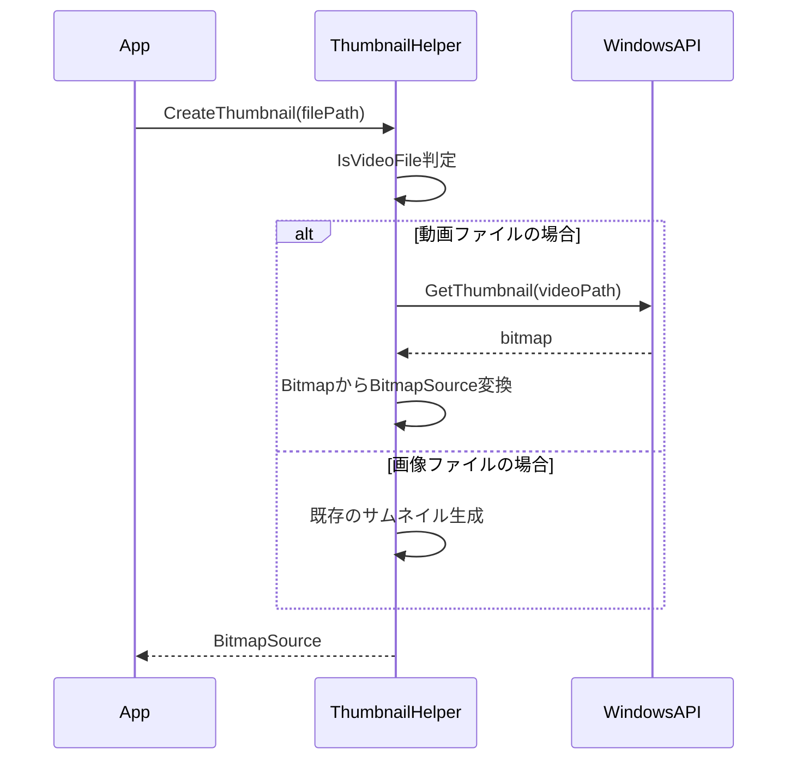
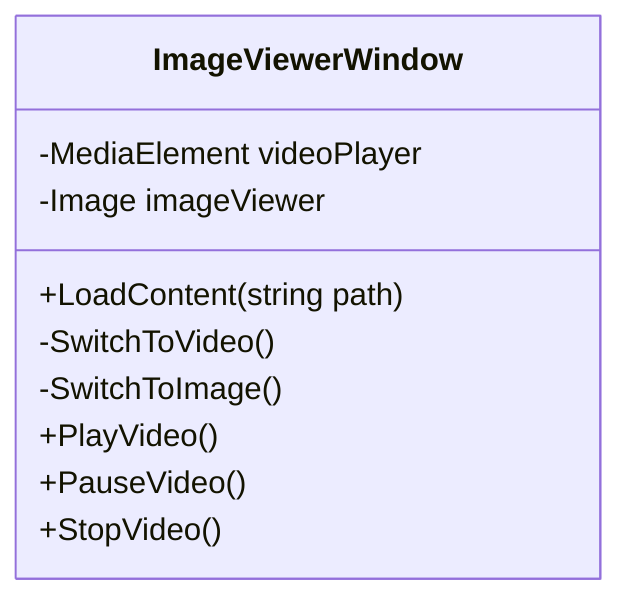

# MP4動画対応の開発計画

## 1. ファイル対応の拡張

### FileHelperの修正
- SupportedExtensionsに ".mp4" を追加
- IsImageFileメソッドの拡張またはIsMediaFileメソッドの追加
- ファイル種別判定のロジック実装

### FileNodeModelの拡張
- IsAnimatedプロパティを拡張してIsVideoも含むように修正
  - IsAnimated → IsAnimatedOrVideo に名称変更
  - アニメーションGIF/WebPと動画を統合的に扱う
  - サムネイル一覧での動画/アニメーションアイコン表示を統一

## 2. サムネイル生成機能の実装

### ThumbnailHelperの拡張

### 実装内容
1. WindowsAPICodePackの導入
2. 動画サムネイル生成メソッドの実装
3. 既存サムネイル生成処理との統合
4. エラーハンドリングの実装

## 3. 動画再生機能の実装

### ImageViewerWindowの拡張

### 実装内容
1. XAML更新
   - MediaElement追加
   - 再生コントロールUI追加
   - 表示切替機能実装

2. コード更新
   - ファイル種別に応じた表示切替
   - 再生制御の実装
   - キーボードショートカット対応

3. フルスクリーン対応
   - MediaElementのフルスクリーン表示
   - コントロールUIの表示制御

## 4. 既存機能との統合

### スライドショー対応
- 動画再生完了時の次ファイル移動
- 再生中のスライドショー制御

### ファイル操作対応
- ドラッグ＆ドロップ操作の対応
- コピー/移動処理の互換性確認
- 削除機能の動作確認

## 5. テスト計画

### 1. ユニットテスト
- サムネイル生成のテスト
- ファイル種別判定のテスト
- 動画再生制御のテスト

### 2. 結合テスト
- ファイル一覧表示のテスト
- サムネイル表示のテスト
- 再生機能のテスト
- ファイル操作のテスト

### 3. UI/UXテスト
- 表示切替の動作確認
- 操作性の確認
- パフォーマンスの確認

## 6. 実装スケジュール

1. ファイル対応拡張 (1日)
2. サムネイル生成機能 (2日)
3. 動画再生機能 (3日)
4. 既存機能との統合 (2日)
5. テストと修正 (2日)

合計: 約10日

## 7. 注意事項

1. パフォーマンス
- サムネイル生成の効率化
- メモリ使用量の最適化
- 動画再生時のリソース管理

2. エラー処理
- 未対応コーデックの処理
- ファイル破損時の対応
- メモリ不足時の対応

3. UX考慮
- 直感的な操作性
- レスポンシブな動作
- 適切なフィードバック
